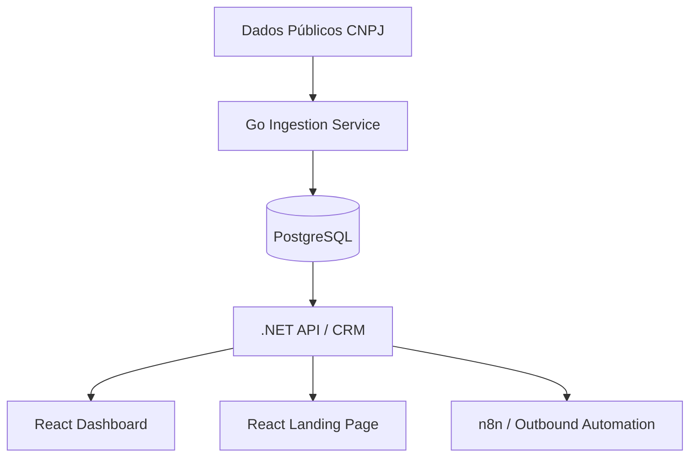

# DominusLeads

DominusLeads é uma plataforma SaaS de prospecção B2B (Outbound) orientada a dados públicos (CNPJ/CNAE), projetada para identificar empresas-alvo e automatizar a qualificação de leads através de múltiplos canais.

## 🚀 Visão Geral

A plataforma utiliza dados oficiais da Receita Federal para permitir que empresas que vendem para outras empresas (B2B) encontrem clientes ideais de forma previsível e escalável, entregando leads qualificados diretamente em um CRM proprietário.

## 🛠️ Stack Tecnológica

O projeto é construído com uma arquitetura moderna e distribuída:

-   **Backend Ingestion & Processing**: [Golang](https://go.dev/)
    - Responsável pelo processamento massivo de dados da Receita Federal (CNPJ, CNAE).
    - Alta performance em parsing de CSVs e normalização de dados.
-   **Core API & CRM**: [.NET / ABP.io](https://abp.io/)
    - Gestão de Multi-tenancy, controle de acessos (IAM), gestão de créditos e faturamento.
    - API robusta para gerenciamento de Leads e integrações de CRM.
-   **Frontend (App)**: [React](https://reactjs.org/)
    - Interface administrativa e painel do usuário para gestão de campanhas e leads.
-   **Landing Page**: [React + Vite](https://vitejs.dev/)
    - Site institucional integrado ao ecossistema Dominus como CRM para captação direta.

## 🏗️ Arquitetura

## 📋 Funcionalidades Principais (MVP)

1.  **Motor de Busca CNAE**: Filtros avançados por segmento, região e situação cadastral.
2.  **Enriquecimento de Dados**: Validação automática de contatos e normalização de telefones/e-mails.
3.  **Qualificação Automatizada**: Integração com WhatsApp e SMS para validação inicial de interesse.
4.  **Gestão de Créditos**: Modelo "Pay-per-lead" qualificado.
5.  **CRM Integrado**: Histórico completo de interações e pipeline de vendas.

## 📂 Estrutura do Repositório (Em breve)

- `/src/Dominus.Ingestion`: Backend Golang para processamento de dados.
- `/src/Dominus.Backend`: Solução .NET (ABP.io) para API e CRM.
- `/src/Dominus.Web.Public`: Landing Page em React.
- `/src/Dominus.Web.App`: Aplicação React principal.
- `/docs`: Documentação técnica e PRDs.

---

*DominusLeads - Transformando dados técnicos em oportunidades reais de negócio.*
