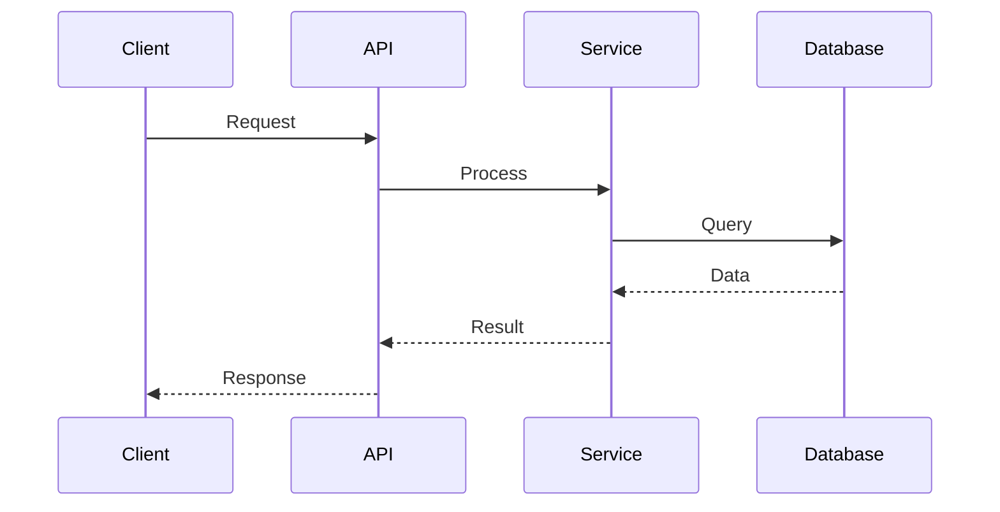
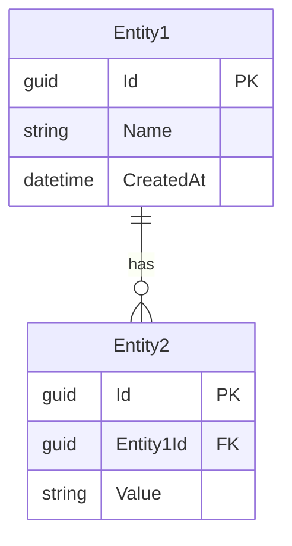

# Create System Design Document

Feature: **$ARGUMENTS.feature**
Scope: **$ARGUMENTS.scope**

## Instructions

### Step 1: Gather Requirements

1. Read requirements from `docs/features/[feature]/requirements.md`
2. Review user stories and acceptance criteria
3. Identify non-functional requirements (performance, scale, security)

### Step 2: Generate System Design

```markdown
# System Design: [Feature/Module Name]

**Version**: 1.0
**Date**: [YYYY-MM-DD]
**Author**: Claude
**Status**: Draft | Review | Approved

## 1. Overview

### 1.1 Purpose
[What this system/feature does and why it exists]

### 1.2 Scope
[What is included and excluded from this design]

### 1.3 Goals
- [Goal 1]
- [Goal 2]
- [Goal 3]

### 1.4 Non-Goals
- [Explicitly out of scope item 1]
- [Explicitly out of scope item 2]

## 2. Requirements Summary

### 2.1 Functional Requirements
| ID | Requirement | Priority |
|----|-------------|----------|
| FR-1 | [Description] | Must Have |
| FR-2 | [Description] | Should Have |

### 2.2 Non-Functional Requirements
| Category | Requirement | Target |
|----------|-------------|--------|
| Performance | Response time | < 200ms P95 |
| Scalability | Concurrent users | 1000+ |
| Availability | Uptime | 99.9% |
| Security | Authentication | OAuth 2.0 |

## 3. Architecture

### 3.1 High-Level Architecture

```
┌─────────────────────────────────────────────────────────────┐
│                        Client Layer                          │
│  ┌─────────────┐  ┌─────────────┐  ┌─────────────┐         │
│  │   Web App   │  │ Mobile App  │  │   Admin     │         │
│  └──────┬──────┘  └──────┬──────┘  └──────┬──────┘         │
└─────────┼────────────────┼────────────────┼─────────────────┘
          │                │                │
          ▼                ▼                ▼
┌─────────────────────────────────────────────────────────────┐
│                        API Gateway                           │
│                    (Authentication, Rate Limiting)           │
└─────────────────────────────┬───────────────────────────────┘
                              │
          ┌───────────────────┼───────────────────┐
          ▼                   ▼                   ▼
┌─────────────────┐ ┌─────────────────┐ ┌─────────────────┐
│  [Service 1]    │ │  [Service 2]    │ │  [Service 3]    │
│                 │ │                 │ │                 │
└────────┬────────┘ └────────┬────────┘ └────────┬────────┘
         │                   │                   │
         ▼                   ▼                   ▼
┌─────────────────────────────────────────────────────────────┐
│                        Data Layer                            │
│  ┌─────────────┐  ┌─────────────┐  ┌─────────────┐         │
│  │  PostgreSQL │  │    Redis    │  │  Blob Store │         │
│  └─────────────┘  └─────────────┘  └─────────────┘         │
└─────────────────────────────────────────────────────────────┘
```

### 3.2 Component Design

#### [Component 1 Name]

**Responsibility**: [What this component does]

**Interfaces**:
- Input: [What it receives]
- Output: [What it produces]

**Dependencies**:
- [Dependency 1]
- [Dependency 2]

```csharp
// Key interface
public interface I[Component]Service
{
    Task<Result> ProcessAsync(Input input);
}
```

#### [Component 2 Name]
[Repeat structure...]

### 3.3 Sequence Diagrams

#### [Use Case 1]: [Name]



## 4. Data Design

### 4.1 Entity Relationship Diagram



### 4.2 Data Models

#### [Entity Name]

| Field | Type | Constraints | Description |
|-------|------|-------------|-------------|
| Id | Guid | PK | Unique identifier |
| Name | string(100) | Required, Unique | Display name |
| Status | enum | Required | Active/Inactive |

### 4.3 Data Flow

[Describe how data flows through the system]

## 5. API Design

### 5.1 Endpoints

| Method | Endpoint | Description | Auth |
|--------|----------|-------------|------|
| GET | /api/[resource] | List resources | Read |
| GET | /api/[resource]/{id} | Get single | Read |
| POST | /api/[resource] | Create | Create |
| PUT | /api/[resource]/{id} | Update | Update |
| DELETE | /api/[resource]/{id} | Delete | Delete |

### 5.2 Request/Response Examples

#### Create [Resource]

**Request:**
```json
POST /api/[resource]
{
    "name": "Example",
    "description": "Description"
}
```

**Response:**
```json
{
    "success": true,
    "data": {
        "id": "guid",
        "name": "Example"
    }
}
```

## 6. Security Design

### 6.1 Authentication
[How users authenticate]

### 6.2 Authorization
| Permission | Description | Roles |
|------------|-------------|-------|
| [Resource].Read | View resources | All |
| [Resource].Create | Create resources | Admin, Manager |
| [Resource].Delete | Delete resources | Admin |

### 6.3 Data Protection
- [Encryption at rest/transit]
- [PII handling]
- [Audit logging]

## 7. Performance Considerations

### 7.1 Caching Strategy
| Data | Cache Location | TTL | Invalidation |
|------|---------------|-----|--------------|
| [Data 1] | Redis | 5 min | On update |

### 7.2 Query Optimization
- [Index strategy]
- [Pagination approach]
- [N+1 prevention]

### 7.3 Scalability
- [Horizontal scaling approach]
- [Load balancing]
- [Database sharding if applicable]

## 8. Error Handling

### 8.1 Error Codes
| Code | HTTP | Description |
|------|------|-------------|
| [ERR001] | 400 | Invalid input |
| [ERR002] | 404 | Resource not found |
| [ERR003] | 409 | Conflict |

### 8.2 Retry Strategy
[Retry and circuit breaker patterns]

## 9. Monitoring & Observability

### 9.1 Metrics
| Metric | Type | Alert Threshold |
|--------|------|-----------------|
| Response time P95 | Histogram | > 500ms |
| Error rate | Counter | > 1% |

### 9.2 Logging
[Key events to log]

### 9.3 Tracing
[Distributed tracing approach]

## 10. Deployment

### 10.1 Dependencies
- [Dependency 1 with version]
- [Dependency 2 with version]

### 10.2 Configuration
| Setting | Default | Description |
|---------|---------|-------------|
| [Setting1] | [Value] | [Description] |

### 10.3 Rollout Plan
1. [Phase 1]
2. [Phase 2]
3. [Phase 3]

## 11. Risks and Mitigations

| Risk | Impact | Likelihood | Mitigation |
|------|--------|------------|------------|
| [Risk 1] | High | Medium | [Strategy] |

## 12. Open Questions

- [ ] [Question 1]
- [ ] [Question 2]

## 13. References

- [Link to requirements]
- [Link to related ADRs]
- [External documentation]
```

### Step 3: Output

1. Write to `docs/features/[feature]/system-design.md`
2. Generate diagrams if mermaid-diagram-patterns skill available
3. Summarize key architectural decisions

## Related Skills

- `technical-design-patterns` - API contracts and specifications
- `mermaid-diagram-patterns` - Diagram generation
- `api-design-principles` - API best practices
