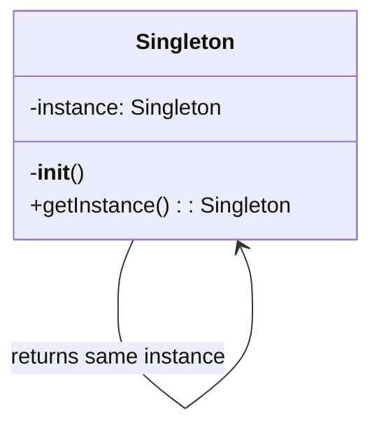
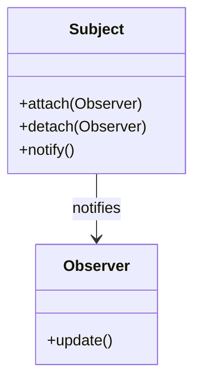

# Code Explanation Patterns Reference

Visual explanations, algorithm visualization, and progressive learning techniques.

## Complexity Assessment

```python
class CodeAnalyzer:
    def analyze_complexity(self, code: str) -> Dict:
        """Analyze code complexity and structure"""
        analysis = {
            'complexity_score': 0,
            'concepts': [],
            'patterns': [],
            'difficulty_level': 'beginner'
        }
        tree = ast.parse(code)
        analysis['metrics'] = {
            'lines_of_code': len(code.splitlines()),
            'cyclomatic_complexity': self._calculate_cyclomatic_complexity(tree),
            'nesting_depth': self._calculate_max_nesting(tree),
            'function_count': len([n for n in ast.walk(tree) if isinstance(n, ast.FunctionDef)])
        }
        analysis['concepts'] = self._identify_concepts(tree)
        return analysis

    def _identify_concepts(self, tree) -> List[str]:
        """Identify programming concepts used"""
        concepts = []
        for node in ast.walk(tree):
            if isinstance(node, (ast.AsyncFunctionDef, ast.AsyncWith)):
                concepts.append('asynchronous programming')
            elif isinstance(node, ast.FunctionDef) and node.decorator_list:
                concepts.append('decorators')
            elif isinstance(node, ast.With):
                concepts.append('context managers')
            elif isinstance(node, ast.Yield):
                concepts.append('generators')
            elif isinstance(node, (ast.ListComp, ast.DictComp)):
                concepts.append('comprehensions')
        return list(set(concepts))
```

## Visual Diagrams

### Flow Diagram Generation (Mermaid)
```python
def generate_flow_diagram(self, code_structure):
    """Generate Mermaid flowchart"""
    diagram = "```mermaid\nflowchart TD\n"
    for i, func in enumerate(code_structure['functions']):
        node_id = f"F{i}"
        diagram += f"    {node_id}[{func['name']}]\n"
        if func.get('parameters'):
            diagram += f"    {node_id}_params[/{', '.join(func['parameters'])}/]\n"
            diagram += f"    {node_id}_params --> {node_id}\n"
    diagram += "```"
    return diagram
```

### Class Diagram (UML)
```python
def generate_class_diagram(self, classes):
    """Generate UML-style class diagram"""
    diagram = "```mermaid\nclassDiagram\n"
    for cls in classes:
        diagram += f"    class {cls['name']} {{\n"
        for attr in cls.get('attributes', []):
            visibility = '+' if attr['public'] else '-'
            diagram += f"        {visibility}{attr['name']} : {attr['type']}\n"
        for method in cls.get('methods', []):
            visibility = '+' if method['public'] else '-'
            diagram += f"        {visibility}{method['name']}() : {method['returns']}\n"
        diagram += "    }\n"
        if cls.get('inherits'):
            diagram += f"    {cls['inherits']} <|-- {cls['name']}\n"
    diagram += "```"
    return diagram
```

## Algorithm Visualization

### Sorting Algorithm
```python
def visualize_bubble_sort(array):
    """Step-by-step bubble sort visualization"""
    steps = ["## Bubble Sort\n**Initial Array**: {array}\n"]
    arr = array.copy()
    for i in range(len(arr)):
        for j in range(0, len(arr)-i-1):
            step = f"Compare [{arr[j]}] and [{arr[j+1]}]: "
            if arr[j] > arr[j+1]:
                arr[j], arr[j+1] = arr[j+1], arr[j]
                step += f"Swap -> {arr}"
            else:
                step += "No swap"
            steps.append(step)
    return '\n'.join(steps)
```

### Recursion Visualization
```
factorial(3)
│
├─> Base case check: 3 == 0? No
├─> Recursive call: factorial(2)
│   │
│   ├─> Base case check: 2 == 0? No
│   ├─> Recursive call: factorial(1)
│   │   │
│   │   ├─> Base case check: 1 == 0? No
│   │   ├─> Recursive call: factorial(0)
│   │   │   │
│   │   │   └─> Base case: Return 1
│   │   └─> Return: 1 * 1 = 1
│   └─> Return: 2 * 1 = 2
└─> Return: 3 * 2 = 6
```

## Concept Explanations

### Decorators
```markdown
## Understanding Decorators

**Analogy**: Like gift wrapping - adds something extra around the original.

```python
# This decorator:
@timer
def slow_function():
    time.sleep(1)

# Is equivalent to:
slow_function = timer(slow_function)
```
```

### Generators
```markdown
## Understanding Generators

**Analogy**: Like a ticket dispenser - gives one value at a time.

```python
def count_up_to(n):
    i = 0
    while i < n:
        yield i  # Produces one value and pauses
        i += 1

for num in count_up_to(5):
    print(num)  # 0, 1, 2, 3, 4
```
```

## Design Pattern Explanations

### Singleton


**Use for**: Database connections, Configuration, Logging

### Observer


**Use for**: Event systems, Model-View architectures

## Common Pitfalls

### Bare Except
```python
# BAD
try:
    risky_operation()
except:
    print("Error")

# GOOD
try:
    risky_operation()
except (ValueError, TypeError) as e:
    print(f"Expected error: {e}")
except Exception as e:
    logger.error(f"Unexpected: {e}")
    raise
```

### Global Variables
```python
# BAD
count = 0
def increment():
    global count
    count += 1

# GOOD
class Counter:
    def __init__(self):
        self.count = 0
    def increment(self):
        self.count += 1
        return self.count
```

## Learning Path Template

```markdown
## Your Learning Path

### Week 1-2: Fundamentals
- Review basic concepts
- Complete exercises
- Build a small project

### Week 3-4: Applied Learning
- Study patterns in codebase
- Refactor simple version yourself
- Compare approaches

### Week 5-6: Advanced Topics
- Explore edge cases
- Learn alternatives
- Contribute to open source
```

## Interactive Examples

### Error Handling
```python
def safe_divide(a, b):
    try:
        result = a / b
        return result
    except ZeroDivisionError:
        print("Cannot divide by zero!")
        return None
    except TypeError:
        print("Please provide numbers!")
        return None
    finally:
        print("Division completed")

# Test cases:
safe_divide(10, 2)    # Success
safe_divide(10, 0)    # Division by zero
safe_divide(10, "2")  # Type error
```

### Async Programming
```python
import asyncio

async def slow_operation(name, duration):
    print(f"{name} started...")
    await asyncio.sleep(duration)
    print(f"{name} completed")
    return f"{name} result"

async def main():
    # Concurrent execution (fast)
    results = await asyncio.gather(
        slow_operation("Task 1", 2),
        slow_operation("Task 2", 2)
    )
    print(f"Results: {results}")

asyncio.run(main())
```
