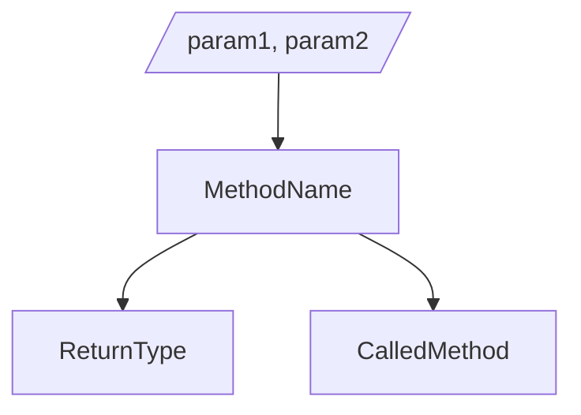
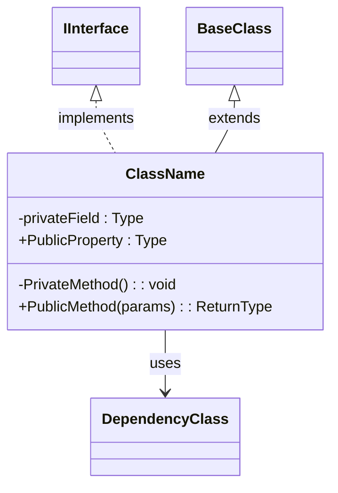
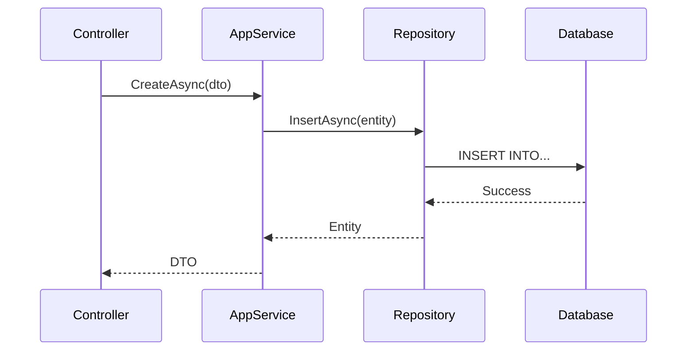
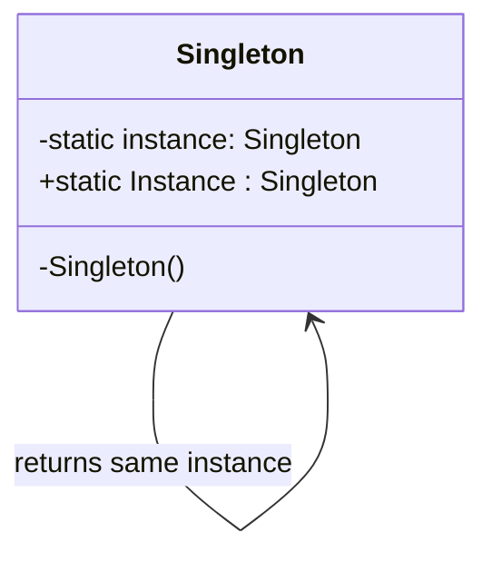
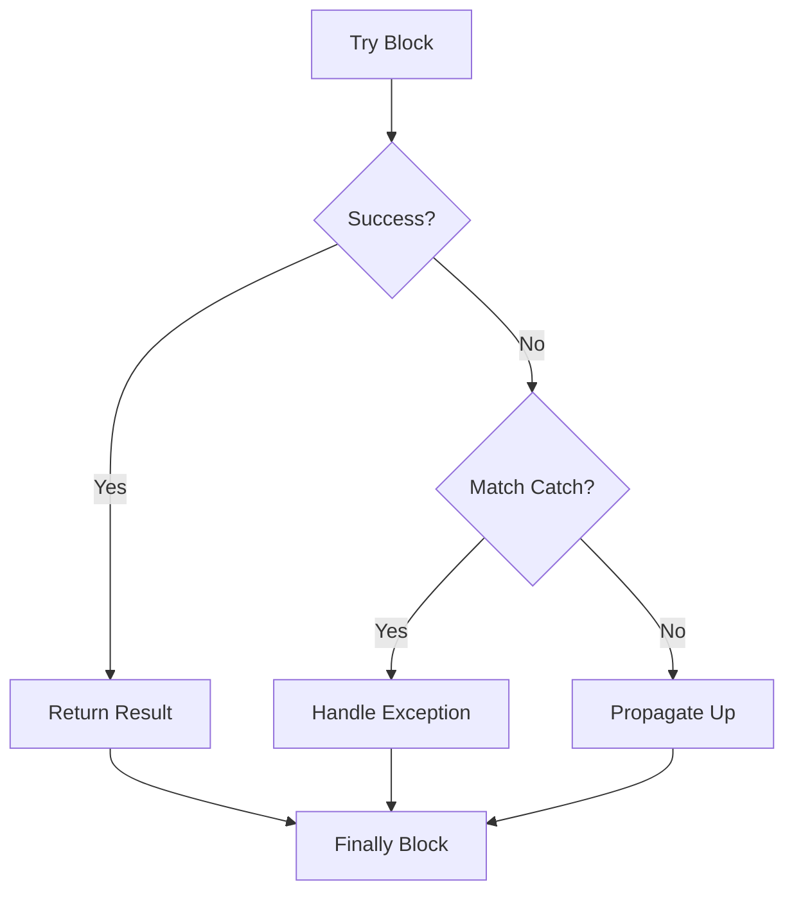

# Code Explanation Templates Reference

Templates and patterns for the `/explain:code-explain` command. All examples are C#/.NET focused.

## Complexity Metrics

### Code Analysis Checklist

```markdown
## Code Complexity Analysis

| Metric | Value | Threshold |
|--------|-------|-----------|
| Lines of Code | {count} | <200 per class |
| Cyclomatic Complexity | {value} | <10 per method |
| Nesting Depth | {depth} | <4 levels |
| Method Count | {count} | <20 per class |
| Dependency Count | {count} | <10 per class |

### Identified Concepts
- [ ] Async/await patterns
- [ ] Dependency injection
- [ ] Repository pattern
- [ ] Unit of Work
- [ ] CQRS pattern
```

---

## Visual Diagram Templates

### Flow Diagram (Mermaid)



### Class Diagram (Mermaid)



### Sequence Diagram (Mermaid)



---

## Concept Explanations

### Dependency Injection

```markdown
## Understanding Dependency Injection

Dependency Injection (DI) is a design pattern where objects receive their dependencies from external sources rather than creating them internally.

**Simple Analogy**: Instead of a chef growing their own vegetables (tight coupling), vegetables are delivered to them (loose coupling). The chef doesn't need to know where vegetables come from.

**How it works in .NET**:
```csharp
// ❌ Without DI - tightly coupled
public class PatientService
{
    private readonly PatientRepository _repository = new PatientRepository();
    // Hard to test - can't mock the repository
}

// ✅ With DI - loosely coupled
public class PatientService
{
    private readonly IPatientRepository _repository;

    public PatientService(IPatientRepository repository)
    {
        _repository = repository; // Injected from outside
    }
    // Easy to test - can inject a mock
}

// Registration in ABP Module
public override void ConfigureServices(ServiceConfigurationContext context)
{
    context.Services.AddTransient<IPatientRepository, PatientRepository>();
}
```
```

### Async/Await

```markdown
## Understanding Async/Await

Async methods allow your program to remain responsive while waiting for I/O operations (database, network, file system).

**Simple Analogy**: Like ordering coffee at a busy café - you place your order and step aside, letting others order while your coffee is being made. When it's ready, you're called back.

**How it works**:
```csharp
// Synchronous - blocks the thread
public Patient GetPatient(Guid id)
{
    var patient = _repository.Get(id); // Thread waits here
    return patient;
}

// Asynchronous - frees the thread
public async Task<Patient> GetPatientAsync(Guid id)
{
    var patient = await _repository.GetAsync(id); // Thread is freed
    return patient;
}

// Running multiple operations concurrently
public async Task<(Patient, Doctor)> GetPatientAndDoctorAsync(Guid patientId, Guid doctorId)
{
    var patientTask = _patientRepository.GetAsync(patientId);
    var doctorTask = _doctorRepository.GetAsync(doctorId);

    // Both run concurrently - total time = max(patient, doctor), not sum
    await Task.WhenAll(patientTask, doctorTask);

    return (await patientTask, await doctorTask);
}
```
```

### Repository Pattern

```markdown
## Understanding Repository Pattern

Repository pattern abstracts data access logic, providing a collection-like interface for accessing domain entities.

**Simple Analogy**: Like a librarian - you don't need to know how books are organized on shelves. You ask the librarian for a book, and they find it for you.

**How it works**:
```csharp
// Interface defines the contract
public interface IPatientRepository : IRepository<Patient, Guid>
{
    Task<Patient?> FindByEmailAsync(string email);
    Task<List<Patient>> GetActivePatientsAsync();
}

// Implementation handles the data access
public class PatientRepository : EfCoreRepository<AppDbContext, Patient, Guid>, IPatientRepository
{
    public async Task<Patient?> FindByEmailAsync(string email)
    {
        var dbSet = await GetDbSetAsync();
        return await dbSet.FirstOrDefaultAsync(p => p.Email == email);
    }

    public async Task<List<Patient>> GetActivePatientsAsync()
    {
        var dbSet = await GetDbSetAsync();
        return await dbSet.Where(p => p.IsActive).ToListAsync();
    }
}

// AppService uses the repository
public class PatientAppService : ApplicationService
{
    private readonly IPatientRepository _repository;

    public PatientAppService(IPatientRepository repository)
    {
        _repository = repository;
    }

    public async Task<PatientDto> GetByEmailAsync(string email)
    {
        var patient = await _repository.FindByEmailAsync(email);
        return ObjectMapper.Map<Patient, PatientDto>(patient);
    }
}
```
```

### LINQ Expressions

```markdown
## Understanding LINQ

LINQ (Language Integrated Query) allows querying data with a SQL-like syntax directly in C#.

**Simple Analogy**: Like having a smart assistant who can filter, sort, and transform lists based on your natural language instructions.

**How it works**:
```csharp
// Query syntax (SQL-like)
var activePatients = from p in patients
                     where p.IsActive && p.Age >= 18
                     orderby p.LastName
                     select new { p.Id, p.FullName };

// Method syntax (fluent)
var activePatients = patients
    .Where(p => p.IsActive && p.Age >= 18)
    .OrderBy(p => p.LastName)
    .Select(p => new { p.Id, p.FullName });

// Common LINQ operations
var first = patients.FirstOrDefault(p => p.Email == email);
var exists = patients.Any(p => p.Status == Status.Active);
var count = patients.Count(p => p.Age > 65);
var grouped = patients.GroupBy(p => p.DoctorId);
```
```

---

## Algorithm Visualization

### Sorting Visualization

```markdown
## How Sorting Works

**Initial List**: [Patient C, Patient A, Patient B]
**Sort By**: LastName ascending

### Step-by-Step (OrderBy):

1. **Compare C and A**: A comes first → [A, C, B]
2. **Insert B in correct position**: B comes after A, before C → [A, B, C]

**Final Result**: [Patient A, Patient B, Patient C]

### C# Implementation:
```csharp
var sorted = patients.OrderBy(p => p.LastName).ToList();

// Multiple sort criteria
var sorted = patients
    .OrderBy(p => p.LastName)
    .ThenBy(p => p.FirstName)
    .ToList();
```
```

### Recursion Visualization

```markdown
## Understanding Recursion

**Example**: Calculate total descendants in an organizational hierarchy

```
GetDescendantCount(CEO)
│
├─> CEO has 3 direct reports
├─> GetDescendantCount(VP1)
│   ├─> VP1 has 2 direct reports
│   ├─> GetDescendantCount(Manager1) → Returns 0 (no reports)
│   └─> GetDescendantCount(Manager2) → Returns 0 (no reports)
│   └─> Returns 2
├─> GetDescendantCount(VP2) → Returns 1
└─> GetDescendantCount(VP3) → Returns 0
│
└─> Returns 3 + 2 + 1 + 0 = 6 total descendants
```

### C# Implementation:
```csharp
public int GetDescendantCount(Employee employee)
{
    if (employee.DirectReports.Count == 0)
        return 0; // Base case

    return employee.DirectReports.Count
        + employee.DirectReports.Sum(r => GetDescendantCount(r)); // Recursive case
}
```
```

---

## Design Pattern Explanations

### Singleton Pattern

```markdown
## Singleton Pattern

### What is it?
Ensures a class has only one instance and provides global access to it.

### Visual Representation:


### C# Implementation:
```csharp
// Modern .NET approach using DI (recommended)
services.AddSingleton<ICacheService, CacheService>();

// Manual implementation (when DI isn't available)
public sealed class CacheService
{
    private static readonly Lazy<CacheService> _instance =
        new Lazy<CacheService>(() => new CacheService());

    public static CacheService Instance => _instance.Value;

    private CacheService() { }
}
```

### When to use:
✅ Configuration managers
✅ Logging services
✅ Cache managers
✅ Database connection pools

### Drawbacks:
❌ Makes unit testing harder (use DI instead)
❌ Hides dependencies
```

### Observer Pattern

```markdown
## Observer Pattern (Events in C#)

### What is it?
Allows objects to notify other objects about state changes without tight coupling.

### C# Implementation with Events:
```csharp
public class PatientService
{
    // Define the event
    public event EventHandler<PatientCreatedEventArgs>? PatientCreated;

    public async Task<Patient> CreatePatientAsync(CreatePatientDto input)
    {
        var patient = new Patient(input.Name, input.Email);
        await _repository.InsertAsync(patient);

        // Raise the event
        PatientCreated?.Invoke(this, new PatientCreatedEventArgs(patient));

        return patient;
    }
}

// Subscriber
public class NotificationService
{
    public NotificationService(PatientService patientService)
    {
        patientService.PatientCreated += OnPatientCreated;
    }

    private void OnPatientCreated(object? sender, PatientCreatedEventArgs e)
    {
        SendWelcomeEmail(e.Patient.Email);
    }
}
```

### ABP Distributed Events (preferred):
```csharp
// Publisher
await _distributedEventBus.PublishAsync(new PatientCreatedEto { PatientId = patient.Id });

// Handler (can be in different service)
public class WelcomeEmailHandler : IDistributedEventHandler<PatientCreatedEto>
{
    public async Task HandleEventAsync(PatientCreatedEto eventData)
    {
        await _emailService.SendWelcomeEmailAsync(eventData.PatientId);
    }
}
```
```

---

## Error Handling Explanations

```markdown
## Understanding Try-Catch-Finally

### Example: Database Operation

```csharp
public async Task<Patient?> GetPatientSafelyAsync(Guid id)
{
    try
    {
        // Code that might fail
        var patient = await _repository.GetAsync(id);
        return patient;
    }
    catch (EntityNotFoundException)
    {
        // Handle specific exception
        _logger.LogWarning("Patient {Id} not found", id);
        return null;
    }
    catch (DbException ex)
    {
        // Handle database errors
        _logger.LogError(ex, "Database error retrieving patient {Id}", id);
        throw new BusinessException("Database unavailable").WithData("PatientId", id);
    }
    finally
    {
        // Always runs (cleanup)
        _logger.LogDebug("GetPatient operation completed");
    }
}
```

### Flow Diagram:

```

---

## Common Code Smells

### Long Method

```markdown
## ⚠️ Long Method

**Problem**: Methods that do too much are hard to understand and test.

**Symptoms**:
- Method > 20-30 lines
- Multiple responsibilities
- Hard to name

**Refactoring**:
```csharp
// ❌ Before: Long method doing everything
public async Task<OrderDto> ProcessOrderAsync(CreateOrderDto input)
{
    // Validate input (10 lines)
    // Calculate totals (15 lines)
    // Apply discounts (20 lines)
    // Process payment (15 lines)
    // Send notifications (10 lines)
    // Return result
}

// ✅ After: Decomposed into focused methods
public async Task<OrderDto> ProcessOrderAsync(CreateOrderDto input)
{
    ValidateOrder(input);
    var order = CreateOrder(input);
    order.Total = CalculateTotal(order);
    ApplyDiscounts(order);
    await ProcessPaymentAsync(order);
    await SendNotificationsAsync(order);
    return MapToDto(order);
}
```
```

### Primitive Obsession

```markdown
## ⚠️ Primitive Obsession

**Problem**: Using primitive types instead of small objects for simple tasks.

**Symptoms**:
- Strings for emails, phone numbers, IDs
- Validation logic scattered everywhere
- Magic numbers/strings

**Refactoring**:
```csharp
// ❌ Before: Primitives everywhere
public class Patient
{
    public string Email { get; set; }  // Could be invalid
    public string Phone { get; set; }  // No format validation
}

// ✅ After: Value objects with validation
public class Patient
{
    public Email Email { get; private set; }
    public PhoneNumber Phone { get; private set; }
}

public record Email
{
    public string Value { get; }

    public Email(string value)
    {
        if (!IsValidEmail(value))
            throw new ArgumentException("Invalid email format");
        Value = value;
    }

    private static bool IsValidEmail(string email) =>
        !string.IsNullOrEmpty(email) && email.Contains('@');
}
```
```

---

## Step-by-Step Template

```markdown
## What This Code Does

{Brief summary of purpose}

**Key Concepts**: {concept1}, {concept2}
**Difficulty Level**: {Beginner|Intermediate|Advanced}

### Step 1: {MethodName}

**Purpose**: {Explain what this method does}

**How it works**:
1. {First step}
2. {Second step}
3. {Third step}

{Flow diagram if complex}

### Step 2: {NextMethod}
...

## Deep Dive: {Concept}

{Detailed explanation with analogy and examples}

## Common Pitfalls

{List potential issues and how to avoid them}

## Practice Exercises

1. **Beginner**: {Simple modification exercise}
2. **Intermediate**: {Extension exercise}
3. **Advanced**: {Redesign exercise}
```

---

## Learning Path Template

```markdown
## Your Personalized Learning Path

### Week 1-2: Fundamentals
- Review basic concepts: {topic1}, {topic2}
- Complete exercises on each topic
- Build a small project using these concepts

### Week 3-4: Applied Learning
- Study the patterns in this codebase
- Refactor a simple version yourself
- Compare your approach with the original

### Week 5-6: Advanced Topics
- Explore edge cases and optimizations
- Learn about alternative approaches
- Contribute to code reviews using these patterns

### Practice Projects:
1. **Beginner**: Create a simple CRUD service
2. **Intermediate**: Add validation and error handling
3. **Advanced**: Implement caching and resilience patterns
```
