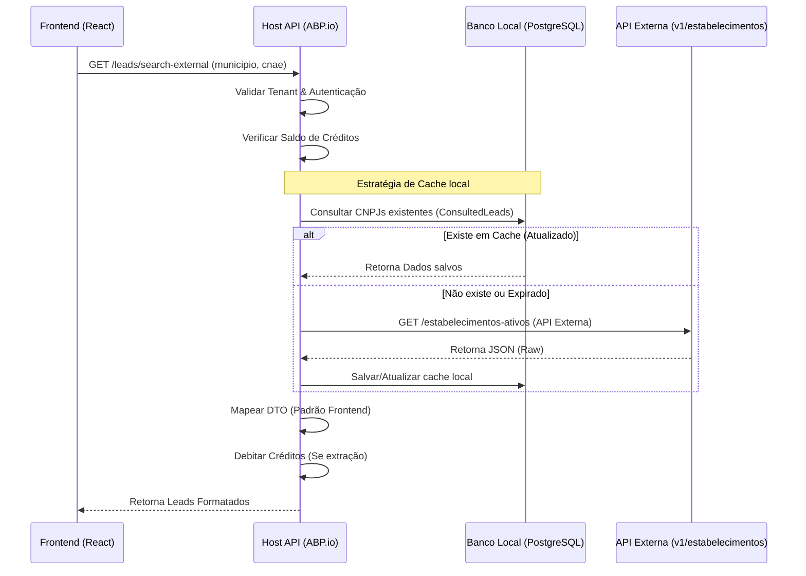

# Documentação do Mapeamento API BFF (DominusLeads)

Este documento descreve o mapeamento da API BFF (Backend for Frontend) baseada em **ABP.io (Multitenant)** necessária para suportar a aplicação DominusLeads em React.

## 1. Visão Geral do Domínio

A aplicação foca em inteligência de mercado e automação de vendas. O BFF atua como orquestrador entre o Frontend React, a base de dados interna (PostgreSQL/SQL Server via ABP) e a API externa de consulta de estabelecimentos.

### Entidades Principais:
-   **Lead**: Empresa ou contato potencial.
-   **Search (Consulta)**: Registro de pesquisas realizadas pelo usuário.
-   **Credit (Crédito)**: Saldo e transações para consumo de serviços (extração/IA).
-   **Event**: Histórico de interações com o Lead (WhatsApp, Automação, Ligação).

---

## 2. Endpoints Padrão ABP.io (Já Disponíveis)

Estes endpoints são nativos do framework ABP e integrados à identidade e multi-tenancy:

| Recurso | Descrição |
| :--- | :--- |
| `/api/account/*` | Autenticação, login, logout, recuperação de senha. |
| `/api/identity/*` | Gestão de usuários, perfis e roles. |
| `/api/multi-tenancy/tenants` | Switch de tenant e gestão multilocatário. |
| `/api/audit-logging/*` | Logs de sistema e trilha de auditoria. |

---

## 3. Endpoints Customizados (BFF)

### 3.1. Inteligência de Mercado & Leads

#### `GET /api/app/leads/search-external`
Interfaceia com a API externa de estabelecimentos.
-   **Query Params**: `municipio`, `cnae`, `bairro`.
-   **Lógica BFF**:
    1.  Verifica se o usuário possui créditos disponíveis.
    2.  Consulta a API externa: `http://89.167.29.36:8080/api/v1/estabelecimentos-ativos`.
    3.  **Cache/Persistence**: Salva os CNPJs retornados na tabela `ConsultedLeads` local (ver seção 4).
    4.  Debita créditos se for uma "extração" (ver detalhes).

#### `GET /api/app/leads`
Lista a base de leads salvos/validados do tenant.
-   **Filtros**: `status` (Novo, Validado, Quente), `segmento`, `localizacao`.

#### `GET /api/app/leads/{id}`
Detalhes completos de um lead, incluindo o histórico de eventos.

#### `POST /api/app/leads/{id}/events`
Registra uma interação (ex: "WhatsApp Enviado").

---

### 3.2. Créditos & Faturamento

#### `GET /api/app/billing/balance`
Retorna o saldo atual (`R$ 454,80`) e estatísticas de uso.

#### `GET /api/app/billing/transactions`
Lista o extrato de uso (Recargas e Consumos).

#### `POST /api/app/billing/recharge`
Inicia um processo de adição de créditos (Integração com Gateway de Pagamento).

---

## 4. Estratégia de Cache e Banco Local

Para otimizar custos e performance, utilizaremos uma estratégia de **Lazy Cache** em banco de dados local.

### Tabela: `ConsultedLeads`
Armazena o JSON bruto ou mapeado das consultas externas para evitar chamadas repetidas à API de terceiros para o mesmo CNPJ.

| Campo | Tipo | Descrição |
| :--- | :--- | :--- |
| `Cnpj` | `string` (PK) | Chave única do estabelecimento. |
| `DataConsulta` | `DateTime` | Data da última atualização vinda da API externa. |
| `RawJson` | `string/JSON` | Dados completos retornados pela API (bairro, telefone, etc). |
| `TenantId` | `Guid` | (Opcional) Se o cache for compartilhado entre tenants ou privado. |

### Fluxo de Consulta com Cache:
1.  O Frontend solicita busca por CNAE/Município.
2.  BFF verifica no banco local se já temos dados atualizados (< 30 dias) para os critérios ou CNPJs comuns.
3.  Se não houver, chama a API externa.
4.  Persiste o resultado no banco local.
5.  Retorna para o React.

---

## 5. Mapeamento de Dados da API Externa

O JSON retornado pela API `estabelecimentos-ativos` deve ser mapeado para o DTO de Lead do frontend:

| API Externa (Campo) | DTO Frontend | Observação |
| :--- | :--- | :--- |
| `nome_fantasia` | `name` | Fallback para `razao_social` se vazio. |
| `cnaes[0]` | `segment` / `cnae` | Usar o primeiro ou o principal. |
| `municipio` + `uf` | `location` | Ex: "Aracaju, SE". |
| `telefone_1` | `phone` | Concatenar com `ddd_1`. |
| `correio_eletronico`| `email` | |

---

---

## 6. Arquitetura da Solução

O diagrama acima e o fluxo sequencial abaixo ilustram como o BFF encapsula a complexidade da integração externa, garantindo segurança e performance via cache local.

### Decisões Técnicas de Design:
- **Encapsulamento**: O Frontend nunca conhece o IP ou a estrutura da API externa directly.
- **Resiliência**: Se a API externa estiver fora do ar, podemos retornar resultados parciais (o que já estiver em cache).
- **Consistência**: O débito de créditos e a entrega dos dados ocorrem em uma operação atômica controlada pelo `Application Service`.
