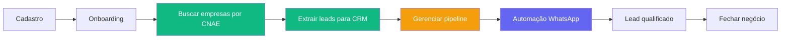

# PRD — Dominus Leads: Visão do Produto

> **Versão:** 1.0 · **Data:** 20/02/2026
> **Autor:** Sapienza Digital · **Status:** Draft

---

## 1. Declaração do Produto

### O que é o Dominus Leads?

O **Dominus Leads** é uma plataforma SaaS de **prospecção B2B inteligente** que transforma dados públicos oficiais da Receita Federal em leads qualificados, prontos para ação comercial. Diferente de ferramentas tradicionais que dependem de tráfego pago ou listas frias compradas, o Dominus utiliza a base real de CNPJs ativos do Brasil, classificados por atividade econômica (CNAE), para encontrar empresas-alvo com precisão cirúrgica.

### Proposta de Valor (Elevator Pitch)

> *"Encontre, qualifique e contate empresas reais — sem depender de tráfego pago. O Dominus Leads transforma dados públicos em oportunidades de negócio, entregando leads B2B verificados direto para o seu CRM, por uma fração do custo do Google Ads."*

### Diferencial Competitivo

| O Dominus Leads... | Enquanto concorrentes... |
|:---|:---|
| Usa dados oficiais (Receita Federal) | Compram listas de terceiros duvidosos |
| Segmenta por CNAE com precisão de 7 dígitos | Trabalham com categorias genéricas |
| Oferece modelo de créditos (pague por resultado) | Cobram por banco de dados ou por acesso |
| Entrega lead já no CRM com timeline | Entregam planilhas frias |
| Automatiza prospecção via WhatsApp/SMS/Email | Param na entrega dos dados |

---

## 2. Para Quem é (ICP — Ideal Customer Profile)

### Clientes Primários

| Segmento | Exemplo | Dor Principal |
|:---|:---|:---|
| **Serviços B2B** | Escritórios de contabilidade, advocacia, consultoria | Precisam prospectar empresas por nicho, não sabem como |
| **Fornecedores regionais** | Facilities, manutenção industrial, SST | Dependem de indicação e networking, falta previsibilidade |
| **Software B2B** | ERPs, CRMs, ferramentas SaaS | Alto CAC via Google Ads, precisam de alternativa outbound |

### Clientes Secundários

| Segmento | Exemplo | Dor Principal |
|:---|:---|:---|
| **Agências de marketing B2B** | Agências de vendas, SDR-as-a-Service | Alto volume de leads para múltiplos clientes |
| **Consultores comerciais** | SDRs independentes, closers | Precisam de dados de qualidade a baixo custo |

### Fora do ICP

- Negócios B2C (varejo, e-commerce)
- Infoprodutores
- Empresas sem processo de vendas ativo

---

## 3. Mapa de Features

### 🔍 F1 — Inteligência de Mercado (Motor de Busca)

**Valor:** Encontrar empresas-alvo por atividade econômica e localização.

| Feature | Status | Descrição |
|:---|:---|:---|
| Busca Rápida (CNAE único) | ✅ Implementada | Typeahead offline com ~1300 CNAEs |
| Busca Avançada (multi-CNAE) | ✅ Implementada | Modal hierárquico com navegação em árvore |
| Busca por Vertical de Mercado | ✅ Implementada | Seletor de segmentos pré-configurados |
| Filtro por Município | ✅ Implementada | Campo texto |
| Filtro por Bairro | ✅ Implementada | Campo texto opcional |
| Expansão automática de subclasses | ✅ Implementada | CNAE genérico → todos os 7 dígitos filhos |
| Deduplicação de resultados | ✅ Implementada | Por CNPJ, em buscas multi-código |
| Indicador "já extraído" | ✅ Implementada | Visual de leads que já estão no CRM |
| Busca por geolocalização (mapa) | 🔮 Futuro | Raio geográfico, heatmap de concentração |
| Filtro por situação cadastral | 🔮 Futuro | Ativa, baixada, suspensa |
| Filtro por porte e capital social | 🔮 Futuro | MEI, ME, EPP, Médio/Grande |

### ⬇️ F2 — Extração de Leads

**Valor:** Converter empresas encontradas em leads acionáveis dentro do CRM.

| Feature | Status | Descrição |
|:---|:---|:---|
| Extração individual | ✅ Implementada | Botão por lead, cria registro no CRM |
| Extração em lote | ✅ Implementada | Seleção múltipla + extração batch |
| Débito de créditos na extração | ✅ Implementada | 10 créditos por lead extraído |
| Evento automático na timeline | ✅ Implementada | "Lead Extraído" registrado automaticamente |
| Cache de dados consultados | ✅ Implementada | ConsultedLead com TTL |
| Enriquecimento com dados extras | 🔮 Futuro | Sócios, capital social, data de abertura |

### 📋 F3 — CRM (Gestão de Leads)

**Valor:** Gerenciar o funil comercial dos leads extraídos.

| Feature | Status | Descrição |
|:---|:---|:---|
| Lista de Leads | ✅ Implementada | Listagem com dados básicos |
| Detalhes do Lead | ✅ Implementada | CNPJ, endereço, contato, CNAE |
| Timeline de Eventos | ✅ Implementada | Histórico cronológico de interações |
| Pipeline Kanban | 🚧 Parcial | UI existe nos protótipos, backend tem Status |
| Filtros e busca | 📋 Planejado | Por status, CNAE, cidade, score |
| Notas e atividades manuais | 📋 Planejado | Registrar ligações, reuniões, propostas |
| Scoring de leads | 🔮 Futuro | Score baseado em perfil e interações |

### 💰 F4 — Créditos & Billing

**Valor:** Modelo de negócio pay-per-result, transparente e previsível.

| Feature | Status | Descrição |
|:---|:---|:---|
| Saldo de créditos | ✅ Implementada | Exibição de saldo atual |
| Extrato de transações | ✅ Implementada | Histórico de débitos e créditos |
| Saldo inicial automático | ✅ Implementada | 1000 créditos ao criar conta |
| Recarga manual (admin) | ✅ Implementada | Via API |
| Recarga online (pagamento) | 📋 Planejado | Stripe/Pagar.me integration |
| Planos de assinatura | 📋 Planejado | Mensal com créditos inclusos |
| Alertas de saldo baixo | 📋 Planejado | Email e in-app |

### 📊 F5 — Dados & Infraestrutura

**Valor:** Base de dados confiável e atualizada.

| Feature | Status | Descrição |
|:---|:---|:---|
| API externa de CNPJs | ✅ Implementada | Proxy com cache para api-cnaes |
| Catálogo CNAE IBGE | ✅ Implementada | Sincronização automática, 5 níveis |
| Verticais de Mercado | ✅ Implementada | Agrupamentos customizáveis de CNAEs |
| Ingestão de dados CNPJ (ETL) | 📋 Planejado | Download mensal da Receita Federal |
| Banco próprio particionado | 📋 Planejado | Sem dependência de API externa |
| Georreferenciamento IBGE | 🔮 Futuro | Mapas e densidade por região |

### 🤖 F6 — Automação de Prospecção

**Valor:** Contatar leads automaticamente e qualificar sem esforço manual.

| Feature | Status | Descrição |
|:---|:---|:---|
| Envio WhatsApp automatizado | 📋 Planejado | Via Twilio / Evolution API |
| Templates configuráveis por tenant | 📋 Planejado | Personalização de mensagens |
| Fallback SMS/Email | 📋 Planejado | Se WhatsApp falhar |
| Classificação automática | 📋 Planejado | Qualificado / Inválido / Não interessado |
| Orquestração n8n | 📋 Planejado | Fluxos versionados |
| Opt-out/LGPD | 📋 Planejado | Respeitar "não quero" |
| Agendamento de horários | 🔮 Futuro | Janelas de envio por tenant |
| IA para classificação | 🔮 Futuro | NLP para entender respostas |

### 🔐 F7 — Autenticação & Multi-Tenancy

**Valor:** Cada cliente em seu ambiente isolado e seguro.

| Feature | Status | Descrição |
|:---|:---|:---|
| Login email/senha | 📋 Planejado | ABP Identity |
| Roles (Admin, Vendedor, Viewer) | 📋 Planejado | Controle de acesso |
| Isolamento por Tenant | 📋 Planejado | Dados segregados por conta |
| SSO (Google) | 🔮 Futuro | Login social |
| API Keys para integrações | 🔮 Futuro | Acesso programático |

### 🏢 F8 — Host Admin (Plataforma)

**Valor:** Gerenciar todos os clientes da plataforma.

| Feature | Status | Descrição |
|:---|:---|:---|
| Dashboard executivo | 📋 Planejado | Visão agregada de todos os tenants |
| CRUD de Tenants | 📋 Planejado | Criar/editar/suspender contas |
| Gestão de Planos | 📋 Planejado | Configurar planos e limites |
| Relatório de consumo | 📋 Planejado | Métricas de uso por tenant |

---

## 4. Modelo de Negócio

### Estratégia de Monetização

```
┌────────────────────────────────────────────┐
│  Plano         │ Créditos │  Preço/mês     │
├────────────────┼──────────┼────────────────┤
│  Starter       │   100    │  R$ 97         │
│  Professional  │   500    │  R$ 297        │
│  Enterprise    │  2.000   │  R$ 697        │
│  Custom        │  10.000+ │  Sob consulta  │
└────────────────────────────────────────────┘
```

**1 crédito = 1 lead extraído** (empresa real, com dados verificados)

### Unit Economics

| Métrica | Valor Alvo |
|:---|:---|
| CAC (Custo de Aquisição) | < R$ 150 |
| LTV (Receita por cliente) | > R$ 2.000 |
| Payback | < 2 meses |
| Churn mensal | < 8% |
| Custo por lead (para a plataforma) | < R$ 0,50 |

---

## 5. Jornada do Usuário



**Legenda:** 🟢 Implementado · 🟡 Parcial · 🟣 Planejado

---

## 6. Métricas de Sucesso

### North Star Metric
**Leads qualificados entregues por mês (todas as contas)**

### Métricas de Suporte

| Categoria | Métrica | Meta MVP |
|:---|:---|:---|
| **Aquisição** | Tenants ativos | 20 |
| **Ativação** | % que faz primeira busca em 24h | > 60% |
| **Engajamento** | Buscas por tenant/mês | > 10 |
| **Retenção** | Churn mensal | < 8% |
| **Receita** | MRR | R$ 10k |
| **Qualidade** | Leads com telefone válido | > 70% |

---

## 7. Riscos e Mitigações

| Risco | Probabilidade | Impacto | Mitigação |
|:---|:---|:---|:---|
| API externa offline/lenta | Média | Alto | Cache local + ingestão ETL |
| Dados de contato baixa qualidade | Alta | Médio | Validação pré-envio + fallback |
| Custo por mensagem WhatsApp | Média | Médio | Rate limiting + templates eficientes |
| Reputação WhatsApp (ban) | Média | Alto | Rotação de números + opt-out rigoroso |
| LGPD | Baixa | Muito Alto | Audit trail + opt-out + termos claros |
| Concorrência (Econodata, Speedio) | Alta | Médio | Preço agressivo + automação integrada |

---

## 8. Roadmap Visual

```
Q1/2026                    Q2/2026                    Q3/2026
├──────────────────────────┼──────────────────────────┼──────────────────────────
│ ✅ Motor de Busca         │ 📋 Automação WhatsApp     │ 🔮 Mapas de Densidade
│ ✅ Extração de Leads      │ 📋 Pipeline Kanban        │ 🔮 IA Classificação
│ ✅ CRM Básico             │ 📋 Billing + Pagamento    │ 🔮 ETL próprio
│ ✅ Créditos               │ 📋 Auth + Multi-Tenancy   │ 🔮 API Pública
│ ✅ Hierarquia CNAE        │ 📋 Host Admin             │ 🔮 Geolocalização
│ ✅ Landing Page           │ 📋 Onboarding             │ 🔮 Score Preditivo
```

---

## 9. Stack Tecnológica

| Camada | Tecnologia |
|:---|:---|
| **Backend** | .NET 10 + ABP Framework 10.x |
| **Frontend** | React 18 + TypeScript + Tailwind CSS |
| **Banco** | PostgreSQL 17 |
| **ORM** | Entity Framework Core + Mapperly |
| **Auth** | ABP Identity + OpenIddict |
| **Cache** | ABP Distributed Cache |
| **Containers** | Docker Compose (dev) → K8s (prod) |
| **Automação** | n8n self-hosted (planejado) |
| **Pagamentos** | Stripe (planejado) |
| **Mensageria** | Twilio / Evolution API (planejado) |
| **Landing** | React + Vite |

---

## Glossário

| Termo | Definição |
|:---|:---|
| **CNAE** | Classificação Nacional de Atividades Econômicas (IBGE) |
| **CNPJ** | Cadastro Nacional de Pessoa Jurídica (Receita Federal) |
| **Lead** | Empresa já extraída para o CRM, pronta para contato |
| **Pré-Lead** | Resultado de busca, ainda não extraído/consumindo crédito |
| **Vertical de Mercado** | Agrupamento de CNAEs que definem um segmento (ex: "Saúde") |
| **Crédito** | Unidade de consumo: 1 crédito = 1 lead extraído |
| **Tenant** | Uma conta/cliente na plataforma (multi-tenancy) |
| **Host** | O administrador da plataforma (Sapienza) |
