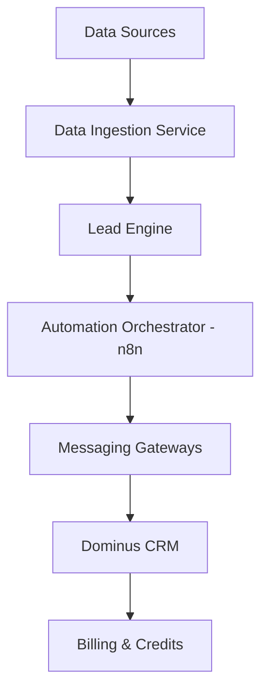

# PRD TÉCNICO — Plataforma de Prospecção B2B por CNAE
## (Dominus Leads – working title)

---

## 1. Definição Formal do Produto

### Categoria
B2B SaaS – Prospecção Ativa (Outbound) orientada a dados públicos

### Descrição resumida
Plataforma SaaS que utiliza dados públicos oficiais (CNPJ, CNAE, estabelecimentos) para identificar empresas-alvo e executar prospecção B2B automatizada e assistida, qualificando contatos via canais digitais e entregando leads estruturados em um CRM proprietário.

---

## 2. ICP (Ideal Customer Profile) — Versão Final

### Regra fundamental
O cliente do SaaS precisa vender para outras empresas (CNPJ). 
**Se o modelo de vendas do cliente for B2C, ele não é ICP.**

### 🎯 ICP Primário (Core do Produto)

1. **Empresas prestadoras de serviços B2B**
   Que vendem soluções recorrentes, consultivas ou contratuais para outras empresas.
   *Exemplos:*
   - Escritórios de advocacia empresarial
   - Escritórios contábeis
   - Consultorias (RH, tributária, ESG, LGPD, TI)
   - Empresas de software B2B
   - Clínicas com atuação corporativa (saúde ocupacional, convênios, parcerias empresariais)

2. **Negócios locais/regionalizados com venda B2B**
   Empresas que dependem de prospecção por segmento + território.
   *Exemplos:*
   - Manutenção industrial
   - Facilities (limpeza, segurança, terceirização)
   - Fornecedores industriais
   - Treinamento corporativo
   - Saúde e segurança do trabalho

### 🎯 ICP Secundário (Escala)

3. **Agências de marketing e vendas B2B**
   - Usam a plataforma para múltiplos clientes
   - Alto consumo de créditos
   - Alto LTV

4. **Consultores comerciais, SDRs e closers independentes**
   - Vendem prospecção como serviço
   - Forte sensibilidade a custo por lead

### ❌ Fora do ICP
- B2C puro
- Clínicas focadas apenas em pacientes finais
- E-commerce
- Infoprodutores
- Negócios sem processo comercial estruturado

---

## 3. Objetivos do Produto

### Objetivo primário
Reduzir o custo e a imprevisibilidade da geração de leads B2B, substituindo (ou complementando) tráfego pago por prospecção baseada em dados oficiais.

### Objetivos secundários
- Criar previsibilidade via modelo de créditos
- Aumentar qualidade do lead (empresa real, ativa, segmentada)
- Entregar lead já estruturado no CRM, pronto para follow-up

---

## 4. Fontes de Dados (Data Layer)

### 4.1 Receita Federal — Dados Abertos CNPJ
- **Entidades principais:** Empresa, Estabelecimento, CNAE (principal e secundários), Telefones (até 2 por estabelecimento), Correio eletrônico (quando disponível), Situação cadastral.
- **Volume:** Dezenas de GB por atualização.
- **Atualização:** Mensal.

### 4.2 IBGE
- Classificação oficial de CNAEs.
- Base de endereços (fase futura).
- Dados georreferenciados (fase futura).

---

## 5. Escopo Funcional (MVP)

### 5.1 Busca e Seleção de Empresas (Pré-Leads)
- **Filtros obrigatórios:** CNAE (principal ou secundário), Município ou Estado, Quantidade desejada.
- **Filtros opcionais (futuro):** Raio geográfico, Situação cadastral, Data de abertura.
- **Resultado:** Lista candidata de empresas-alvo, ainda não consumindo créditos.

### 5.2 Preparação e Enriquecimento
- **Processos automáticos:** Associação Empresa ↔ Estabelecimento, Normalização de telefone (E.164), Validação sintática de e-mail, Deduplicação interna, Identificação de múltiplos contatos.

### 5.3 Automação de Qualificação (Outbound)
- **Canais (MVP):** WhatsApp (principal), SMS (fallback), E-mail (quando disponível).
- **Fluxo padrão:** Envio de mensagem inicial contextualizada (B2B). Pergunta objetiva de validação: Confirmação da empresa e papel (responsável/decisor).
- **Classificação automática:** Lead qualificado, Contato inválido, Não interessado, Sem resposta.
- **Orquestração:** n8n self-hosted, Templates configuráveis por cliente.

### 5.4 CRM e Créditos
- **1 crédito** = 1 lead qualificado entregue.
- Leads inválidos, recusados ou sem resposta não consomem crédito.
- Lead criado automaticamente no Dominus CRM com histórico completo de interações.

---

## 6. Arquitetura Técnica (Detalhada)

### 6.1 Visão Geral (Logical Architecture)

### 6.2 Componentes

1. **Data Ingestion Service**
   - Responsabilidades: Download mensal da base CNPJ, Parse de CSVs massivos, Normalização e Persistência.
   - Tecnologias: Python / .NET worker, Storage em objeto (S3-like).

2. **Lead Engine**
   - Responsabilidades: Consultas por CNAE/localidade, Deduplicação, Scoring básico, Controle de pré-leads vs leads consumidos.
   - Banco: PostgreSQL (particionamento por UF/CNAE), Índices agressivos.

3. **Automation Orchestrator**
   - n8n self-hosted, Fluxos versionados, Rate limiting por tenant.

4. **Messaging Gateways**
   - WhatsApp (Twilio, Evolution API, Meta), SMS provider, SMTP/Email API.
   - Requisitos: Rotação de números, Controle de reputação, Opt-out automático.

5. **Dominus CRM**
   - Multi-tenant, API-first.
   - Entidades: Company (Lead), Contact, Interaction, Pipeline / Stage.

6. **Billing & Credits**
   - Controle de saldo por tenant, Débito somente em lead qualificado, Auditoria de consumo.

---

## 7. Requisitos Não Funcionais
- Escalabilidade horizontal
- Processamento assíncrono
- Observabilidade (logs, métricas)
- Segurança e isolamento por tenant
- Conformidade LGPD (opt-out, logs)

---

## 8. Desafios Críticos

### Técnicos
- Volume e performance dos dados CNPJ.
- Qualidade variável de telefones/emails.
- Deduplicação confiável.

### Operacionais
- Custos por mensagem (WhatsApp).
- Limites de providers e gestão de reputação.

### Legais
- LGPD (legítimo interesse).
- Registro de negativa/opt-out.
- Termos claros de uso responsável.

---

## 9. Estimativa de Custos (Ordem de Grandeza)

| Item | Descrição | Custo Mensal |
| :--- | :--- | :--- |
| **Infra** | Storage + VPS | R$ 400 – 800 |
| **Banco** | PostgreSQL Gerenciado | R$ 300 – 500 |
| **Orquestração** | n8n | R$ 100 – 200 |
| **Comunicação** | WhatsApp (~800 leads) | R$ 120 – 300 |

---

## 10. Roadmap

- **Fase 1 — MVP Técnico:** Importação CNPJ, Filtro CNAE + município, WhatsApp outbound simples, Integração Dominus.
- **Fase 2 — Produto:** Templates configuráveis, Relatórios, Gestão de créditos.
- **Fase 3 — Diferenciação:** Geolocalização, Mapas de densidade CNAE, Sugestão de nichos.

---

## 11. Critérios de Sucesso
- CAC menor que tráfego pago.
- Taxa de validação > 20–30%.
- Retenção mensal e consumo recorrente de créditos.
